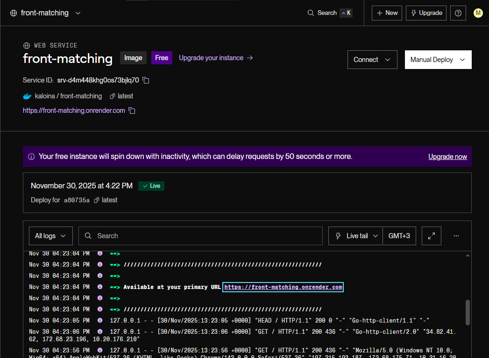
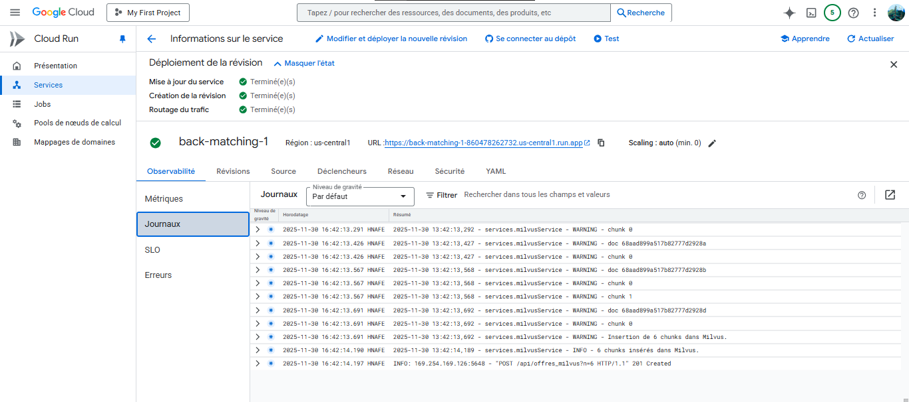

# Matching

**EN:**  
TalentMatch is designed to provide value to both sides: helping candidates find opportunities that truly align with their profile, and enabling recruiters to identify relevant talent more efficiently. In this project, I took over the [original matching system](https://github.com/MBDS-ANTENNES-24-25/projets-d-innovation-talentmatch-groupe1-tpi) and optimized it by switching to an embedding‑based workflow with **Milvus** as the vector store, which resulted in faster, more accurate, and more scalable processing.

**FR:**  
TalentMatch est conçu pour apporter de la valeur aux deux parties : accompagner les candidats dans la recherche d’opportunités réellement alignées avec leur profil, et aider les recruteurs à identifier plus efficacement les talents pertinents. Dans ce projet, j’ai repris le [système de matching initial](https://github.com/MBDS-ANTENNES-24-25/projets-d-innovation-talentmatch-groupe1-tpi) et l’ai optimisé en passant à un workflow basé sur les embeddings, avec **Milvus** comme vector store, ce qui a permis d’obtenir un traitement plus rapide, plus précis et plus scalable.

```
    https://front-matching.onrender.com/
```

## 3.1 Monorepo structure / Structure du monorepo

```
Matching-monorepo/
├── Matching/          # Backend (FastAPI)
├── Frontend-Matching/ # Frontend (React)
├── .github/workflows/ # Pipelines CI/CD
└── docker-compose.yml # Dev local
```

# 1. Recruiter's View / Vue Côté Recruteur

## 1.1 Offline view – Global list of candidates / Vue non connectée – Liste globale des candidats


**EN:**  
When a recruiter accesses the platform without being logged in:  
- They can browse the **global list of candidates** stored in the database.  
- A **red banner** invites them to **log in** to **see automatically generated matches** suggested by the system.  
- Candidate profiles display key public information: **experience, education, main skills**, etc.  
- The recruiter does not yet see any scores or personalized matches.

**Available filters:**  
The recruiter can also refine their search by using:  
- **Keyword search**: name, role, or skill  
- **Education filter**: e.g. “Master”, “Bachelor” (Licence)  
- **Job/skill filter**: e.g. “Internship”, “Java”, “Finance”.

**FR :**  
Lorsqu’un recruteur accède à la plateforme sans être connecté :
- Il peut consulter la **liste globale des candidats** enregistrés dans la base.
- Une **bannière rouge** l’invite à **se connecter** pour **voir les correspondances automatiques** générées par le système.
- Les profils affichent les principales informations publiques : **expériences, formations, compétences clés**, etc.
- Le recruteur ne voit pas encore les scores ni les correspondances personnalisées.

### Filtres disponibles
Le recruteur peut également effectuer des recherches :
- **Recherche par mot-clé** : nom, poste ou compétence.  
- **Filtrage par formation** : ex. “Master”, “Licence”.  
- **Filtrage par poste ou compétence** : ex. “Stage”, “Java”, “Finance”.

---

## 1.2 Connected view – Matching Offer → Candidates / Vue connectée – Matching Offre → Candidats


**EN:**  
Once logged in, users can access a feature that helps them find candidates matching a given job offer.  
They fill out a form describing the offer and, once the form is validated and submitted, the system **analyzes the set of candidates against this offer** and **displays a list of recommended candidates**, ranked by **score**.

**Internal workflow:**  
The system:  
- generates a vector embedding from the content of the offer,  
- queries Milvus to perform a vector search over all encoded CVs,  
- automatically retrieves the closest candidates based on vector similarity,  
- sorts the results,  
- returns to users the **top n recommended candidates**.

**FR :**  
Les utilisateurs peuvent accéder à une fonctionnalité permettant de trouver des candidats correspondant à leur offre.  
Ils remplissent un formulaire pour l'offre. Une fois le formulaire vérifié et envoyé, le système **analyse des candidats par rapport à l'offre** et **affiche une liste de recommandations de candidats**, triées par **score**.


### Fonctionnement côté interne
Le système :
- génère un embedding vectoriel du contenu de l’offre,
- interroge Milvus pour effectuer une recherche vectorielle sur l’ensemble des CV encodés,
- récupère automatiquement les candidats les plus proches selon la similarité des vecteurs,
- trie les résultats,
- propose aux utilisateurs les top n candidats recommandés.

---

# 2. Candidate View / Vue Côté Candidat

## 2.1 Offline view – Global list of offers / Vue non connectée – Liste globale des offres


**EN:**  
When a visitor browses job offers without being logged in:  
- They see the **global list of available offers** (title, company, contract type, summary, etc.).  
- A **red banner** informs them that they must **log in or create a candidate profile** to access their personalized matches.  
- No similarity score is displayed in this view.

**Available filters:**  
Even when not logged in, the candidate can refine their search by using:  
- **Keyword search**  
- **Contract type**  
- **Company**  
- **Sorting** (relevance, date)  
- **Reset** to clear filters.

**FR :**  
Lorsqu’un visiteur consulte les offres sans être connecté :
- Il voit la **liste générale des offres disponibles** (titre, entreprise, type de contrat, résumé, etc.).
- Une **bannière rouge** l’informe qu’il doit **se connecter ou créer un profil candidat** pour accéder à ses correspondances personnalisées.  
- Aucun score de similarité n’est affiché dans cette vue.

### Filtres disponibles
Même sans connexion, le candidat peut affiner sa recherche :
- **Recherche par mot-clé**
- **Type de contrat**
- **Entreprise**
- **Tri** (pertinence, date)
- **Réinitialisation**

---

## 2.2 Connected view – CV matching → Job offers / Vue connectée – Matching CV → Offres


**EN:**  
When logged in, the user can access the matching feature to find offers that best fit their profile. Two options are available:

### Option 1: Fill in a complete form  
Includes:  
- Personal information  
- Experience  
- Education  
- Skills  

### Option 2: Upload a CV (PDF or DOCX)  
- Automatic text extraction  
- Generation of a **normalized JSON structure**  
- Validation  
- Launch of the **matching** system  

**FR :**  
Deux options s’offrent à l’utilisateur :

### Option 1 : Remplir un formulaire complet  
Avec :
- Informations personnelles  
- Expériences  
- Formations  
- Compétences  

### Option 2 : Uploader un CV (PDF ou DOCX)
- Extraction automatique du texte  
- Génération d’une **structure JSON normalisée**  
- Validation 
- Lancement du système de **matching**  

---

## 2.3 Internal operations – Matching resumes → Job offers / Fonctionnement interne – Matching CV → Offres

**EN:**  
Internal steps:  
- Extraction of text from the CV  
- Transformation into a JSON structure via LLM (Gemini)  
- Data validation  
- Generation of the candidate’s vector embedding  
- Querying Milvus to retrieve the offers whose vectors are closest  
- Ranking of the results by vector similarity score  

**Result:**  
The user obtains a list of offers ranked by compatibility, based on vector distance and the real relevance between their profile and the available positions.

**FR :**  
Étapes internes :
- Extraction du texte depuis le CV
- Transformation en structure JSON via LLM (Gemini)
- Validation des données 
- Génération de l’embedding vectoriel du candidat
- Interrogation de Milvus pour rechercher les offres dont les vecteurs sont les plus proches
- Classement des résultats par score de similarité vectorielle

**Résultat :**
L’utilisateur obtient une liste d’offres classées par compatibilité, basée sur la distance vectorielle et la pertinence réelle entre son profil et les postes disponibles.

---

# 3. Frontend and Backend Deployment / Déploiement du Frontend et Backend

## 3.1 Pipeline CI/CD – GitHub Actions

**EN:**  
On every push or merge on the `main` branch:  
1. Docker image build  
2. Push to DockerHub  
3. Automatic deployment (Render + Cloud Run)

Workflows used:  
- `sync-modules.yml`: detects changes in the main branches of the monorepo.  
- `ci-cd.yml`: manages the **build** and **push** of Docker images for the frontend and backend.

**FR :**  
À chaque push ou merge sur `main` :
1. Build Docker  
2. Push DockerHub  
3. Déploiement automatique (Render + Cloud Run)

Workflows utilisés :
- `sync-modules.yml` : permet la **détection des modifications** dans les branches principales du monorepo.
- `ci-cd.yml` : gère le **build** et le **push** des images Docker pour le frontend et le backend.

---

## 3.2 Frontend Deployment – Render.com / Déploiement Frontend – Render.com



**EN:**  
- Docker image: `kaloina/front-matching:latest`  
- Triggered via webhook  
- URL: https://front-matching.onrender.com/

**FR :**  
- Image Docker : `kaloina/front-matching:latest`
- Trigger via webhook
- URL : https://front-matching.onrender.com/

---

## 3.3 Backend Deployment – Google Cloud Run / Déploiement Backend – Google Cloud Run



**EN:**  
- Docker image: `kaloina/back-matching:latest`  
- Automatic scaling  
- URL: https://back-matching-1-860478262732.us-central1.run.app

**FR :**  
- Image Docker : `kaloina/back-matching:latest`
- Scaling automatique
- URL : https://back-matching-1-860478262732.us-central1.run.app

---

# 4. Summary of how Matching works overall / Résumé du fonctionnement global du Matching

**EN:**  
### Matching Offer → Candidates (Recruiter)
- Offer input  
- Analysis & embeddings  
- Similarity computation  
- Candidate recommendations  

### Matching CV → Offers (Candidate)
- Upload or form  
- Extraction & structuring  
- Embeddings  
- Offer recommendations  

**FR :**  
### Matching Offre → Candidats (Recruteur)
- Saisie offre  
- Analyse & embeddings  
- Calcul similarités  
- Recommandation candidats  

### Matching CV → Offres (Candidat)
- Upload ou formulaire  
- Extraction + structuration  
- Embeddings  
- Recommandation offres  
